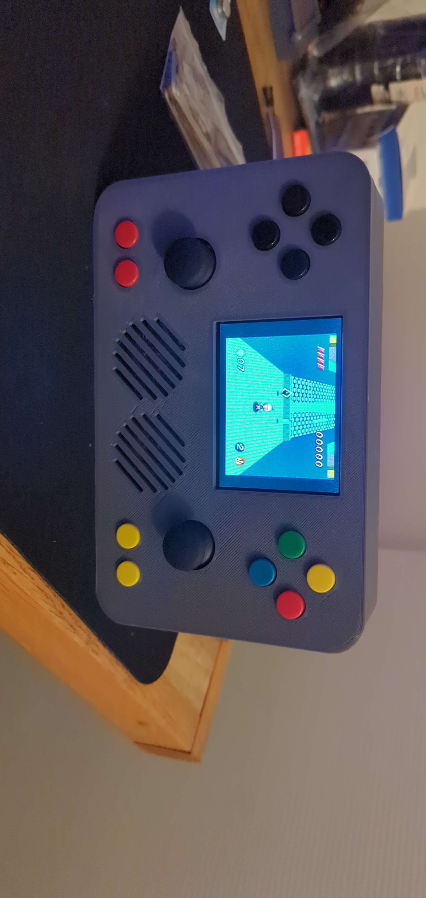

# Raspberry Pi Portable Gamepad Driver
This is a driver I wrote for the gamepad for my Raspberry Pi Portable running RetroPie. All of the buttons are connected to available GPIO pins as well as the two HiLetgo Analog Joy Sticks.

If you want to build this, you can find the design and parts list [here](https://www.thingiverse.com/thing:6469374)

# Phyiscal Parts I Used and Tested With
I used a few specific parts that this software interfaces with. The buttons are just tact switches wired directly to the GPIO pins. There is nothing special about those. But for the analog sticks, I used HiLetgo Joysticks I found on Amazon. For the Analog Digital Converter (ADC), I'm using the NOYITO PCF8591 Analog to Digital Converter that I also found on amazon. I'll list links to where I bought each part below.

- [HiLetgo Analog Stick](https://www.amazon.com/HiLetgo-Controller-JoyStick-Breakout-Arduino/dp/B00P7QBGD2)
- [NOYITO PCF8591 ADC](https://www.amazon.com/dp/B07DQGQYJW?psc=1&ref=ppx_yo2ov_dt_b_product_details)

In theory, you could use any analog stick and Analog to Digital Converter and just hook them up to the SCL and SDA pins, but these are the ones I've personally used and tested with.

# Issues
The problem with the joysticks that I used is they kind of are terrible. They feel great, but the values read seem to be inaccurate. For example, on one of the sticks I got, the Y value produced the exact expected values once run through the ADC, but the X Axis had a range of 2 -> 252 with a mid value (neutral position) of 207. A correct reading would be a range of 0 -> 255 with a mid value of 128. It'll never be perfect, but this was WAY off. I accounted for this in the software.

# Joystick Callibration
Because of the issues mentioned above, I had the driver read the joystick values from an XML config file and then callibrate based on the values coming off the ADC to an expected range (ie. 0-255). The button combination in the driver to start the callibration is A + DPad Down + R1 + L1 + R2 + L2. It's best to be SSHed into the Pi when running the callibration script so you can see the console output that's prompting you for input. Careful with this, cause the callibration will overwrite the xml config file and if you mess up the values too badly it could crash the driver and you won't be able to run it. If this happens, just pull the XML file from this repo and try again. That should at least get you to a state where the driver will run and you can attempt callibration again.
